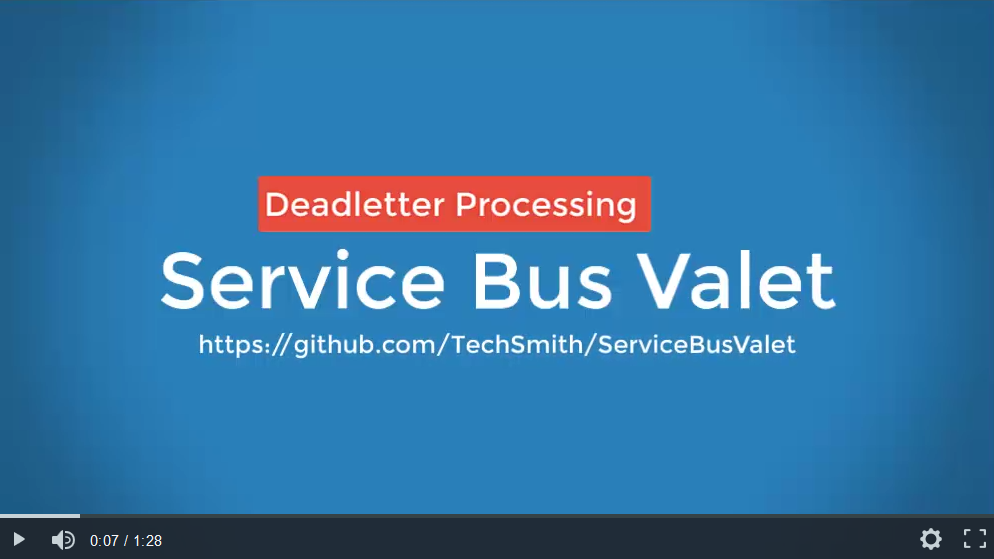

# Service Bus Valet #

The Service Bus Valet is a C# .NET, WPF application used to inspect and reprocess Deadletter messages in Service Bus Topics / Subscriptions.

## MIT License ##

[MIT License Copyright (c) 2019 TechSmith](License.txt)

## Deadletter Processing Demonstration ##

[](https://www.screencast.com/t/Ve8vL2EDydd)

## Frequently Asked Questions ##

Q: When I open the application for the first time it is asking me for an Environments file. What is this?

A: This is a .json file that has the connection strings for your environments. A sample file `EnvironmentConnectionStrings.json` is included in the project root. Update it with a text editor with your connection strings. The connection string can be pulled directly from your Service Bus namespace in Azure Portal.

``` json
{
   "EnvironmentConnectionStrings": [
      {
         "Environment": "<YOUR_ENVIRONMENT_NAME_1>",
         "ConnectionString": "Endpoint=sb://<INSERT_SERVICEBUS_NAME>.servicebus.windows.net/;SharedSecretIssuer=owner;SharedSecretValue=<INSERT_SHARED_SECRET>"
      },
      {
         "Environment": "<YOUR_ENVIRONMENT_NAME_2>",
         "ConnectionString": "Endpoint=sb://<INSERT_SERVICEBUS_NAME>.servicebus.windows.net/;SharedSecretIssuer=owner;SharedSecretValue=<INSERT_SHARED_SECRET>"
      }
   ]
}
```

Q: Why is this utility called Service Bus Valet?

A: In the U.S. a valet can be a person who parks cars for guests at a hotel, restaurant, etc. The Service Bus Valet moves your messages for you.

Q: Why would I use this over Service Bus Explorer?

A: TechSmith regularly uses this to reprocess n-thousands of messages, which can be difficult to do with Service Bus Explorer.

## Known Issues ##

- When dealing with Deadletter queues you are not able to receive a specific message even if you know unique properties of that message. Receives always grab the oldest message or the first message that had arrived FIFO style. This makes the UI a bit awkward as you can peek at messages but not select a specific message from the list of peeked messages to resend. Instead you have to resend the top X messages.
- Re-sending messages is done through a background worker which means that the UI remains responsive. You can also stop the batch using the Stop menu if you decide to abort processing early. However the UI does not prevent you from starting a second batch of message processing while the first is in progress however this will not currently work and should not be attempted.
- Using the Microsoft Service Bus SDK you cannot call GetBody on a BrokeredMessage more than once so the results must be cached the first time. This is the purpose of the message body dictionaries in models/cache folder. The messages bodies are stored in the dictionary by MessageId however I found out later that MessageIds are not required to be Unique so this may not always work. For our services the MessageId is a GUID so this will be acceptable.

## Dependencies ##

Dependencies are pulled in via NuGet packages and are used without modification unless otherwise noted.

### NLog ###

NLog is used with a custom target that will output messages in realtime to a WPF control. This provides status of batch processing jobs as they are in flight as well as any errors or exceptions. By adding additional targets to the NLog.config file it would be trivial to also output messages to a log file, sql database or any other target supported by NLog of which there are many: [https://github.com/nlog/nlog/wiki/Targets](https://github.com/nlog/nlog/wiki/Targets "NLog Targets")

- [Source Code](https://github.com/NLog/NLog)
- [License BSD 3-Clause "New" or "Revised" License](https://github.com/NLog/NLog/blob/dev/LICENSE.txt)

### Costura.Fody ###

The Costura add-in for Fody is used to embed dependencies as resources. This NuGet package allows us to combine .dlls into a single executable.

- [Source Code](https://github.com/Fody/Costura)
- [MIT License](https://github.com/Fody/Costura/blob/master/license.txt)

### NLog Viewer ###

Nlog Viewer is a simple WPF control to show log messages.

The NLogViewer control is responsible for displaying log messages in a realtime fashion. We use this to show progress and errors of any batch jobs that are processing.

The control was custom modified so that it will auto scroll as new messages come in, thus keeping new messages always in view.

- [Source Code](https://github.com/erizet/NlogViewer)
- [MIT License](https://github.com/erizet/NlogViewer/blob/master/license.md)

## Code Organization ##

### Controllers ###

The purpose of the Controllers folder is to provide a controller for each XAML view. All of the logic required by the page will be present here and the code-behind for the XAML will call methods on its respective controller

### Controls ###

The Controls folder contains the modified source code for a custom WPF control called the NLogViewer. The original source can be found on Github: [https://github.com/erizet/NlogViewer](https://github.com/erizet/NlogViewer "NLogViewer")

### Models ###

The purpose of the Models folder is to contain classes that store the real state content of the application.

### Services ###

Services are responsible for making the calls to Azure ServiceBus to deal with connections, topics and subscriptions.

### ViewModel ###

The purpose of the ViewModel folder is to provide the actual data for what will be displayed in a XAML view.
